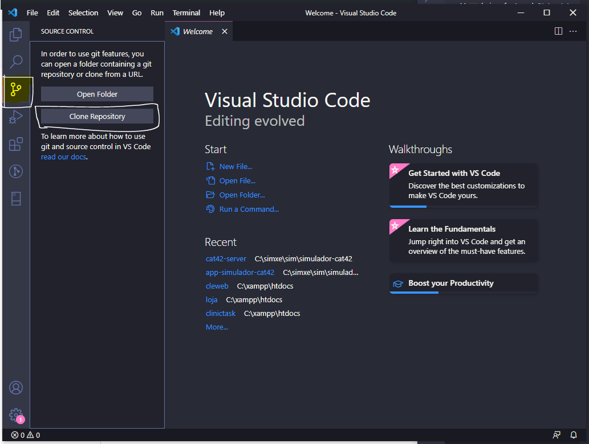
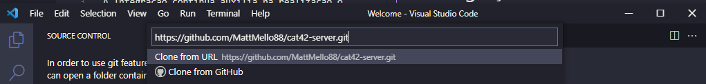
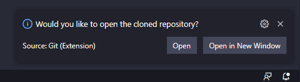
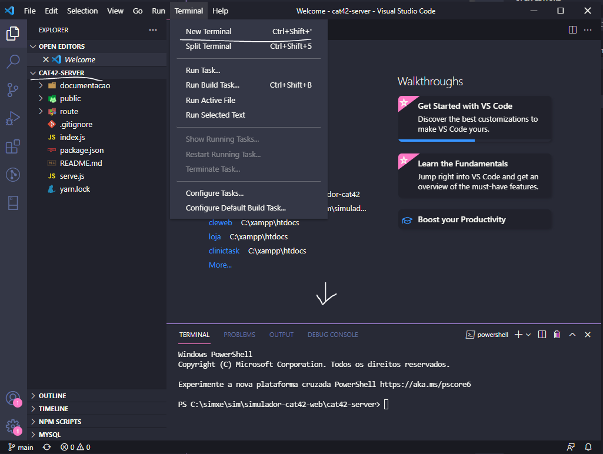

# Clone do Código Fonte do Github

## `Repositórios`

Links do Clone

> https://github.com/MattMello88/cat42-server.git
> https://github.com/MattMello88/app-simulador-cat42.git

## `Com baixar o código fonte`

Abrir o VSCode.



Clique no botão do lado esquerdo "Source Control" em seguida no botão "Clone Repository"



Informe neste campo o um dos links do repositório e de um "Enter". Em seguida vai te solicitar um pasta.

> nota: mantive o padrão de deixar os código fontes na pasta c:\simxe\sim\ e coloquei o nome da pasta de simulador-cat42-web

> nota: a primeira vez o VSCode solicitará permissão para ter acesso ao github.

Ao finalizar o VSCode realiza o download.



O VSCode já pergunta para abrir o seu projeto, só precisa clicar em "Open"

Realize este mesmo procedimento para o proximo link.

## `Baixar os Pacotes`

Com o projeto aberto iremos baixar os pacotes que foram utilizados no desenvolvimento.



Abrir o terminar no projeto e excutar o comando abaixo

```sh
# yarn
```

Realizae este mesmo procedumento para o outro projeto

> Conhecimento: dentro de cada projeto existe o arquivo package.json, este arquivo não pode ser deletado do projeto. Este arquivo contem toda as informações do projeto. E atravez deste arquivo que se realiza o download dos pacotes. \
> O objetico deste arquivo é para não subir todo o código fonte dos pacotes e cada computador com sua configuração diferenciadas ao baixar o pacote será configurado conforme a configuração