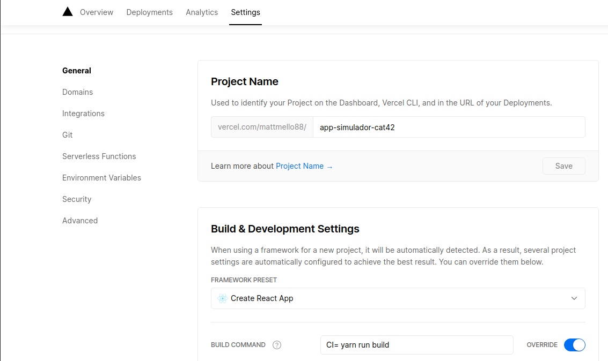

# Integração Continua

A Integração continua auxilia na realização o deploy, o teste, o submit tudo automatizado.

## Vercel

[https://vercel.com/](https://vercel.com/)

Configurar no vercel para compilar com yarn



### `Install`

Só é preciso realacionar o seu repositório do git em um novo projeto do vercel

## Chromatic

[https://www.chromatic.com/](https://www.chromatic.com/)

### `Install`

Relacione o seu repostiório do git com o chromatic e te solicitara para instalar

```sh
# yarn add --dev chromatic
```

Os instalar o CI colocar este comando

## Codecov

[https://app.codecov.io/](https://app.codecov.io/)

### `Install`

## CI - CircleCI

[https://circleci.com/](https://circleci.com/)

### `Install`

Adicionar a pasta .circleci e o arquivo config.yml com suas configurações. Subir antes de configuarar no site
